# はじめに
このたびはDeco40をお買い上げいただきありがとうございます。  
Deco40は以下のような特徴を持つキーボードです。
- 多様なレイアウトに対応
- 基本的にはんだ付け不要
- ガスケットマウント・ダンピングボールマウントに対応した心地良い打鍵感

Deco40によってあなたのキーボードライフがより良いものとなれば幸いです。

# 1. 準備
## 1.1. パーツ・工具の確認
### 1.1.1 キットに含まれるパーツ・工具
キットには以下のパーツ・工具が含まれています。
不足がある場合は[6. 連絡先](#6-連絡先)までご連絡ください。

| 名称                        | 数量        | 画像                                | 説明                                                                  |
|-----------------------------|-------------|-------------------------------------|-----------------------------------------------------------------------|
| メインケース                | 1           |      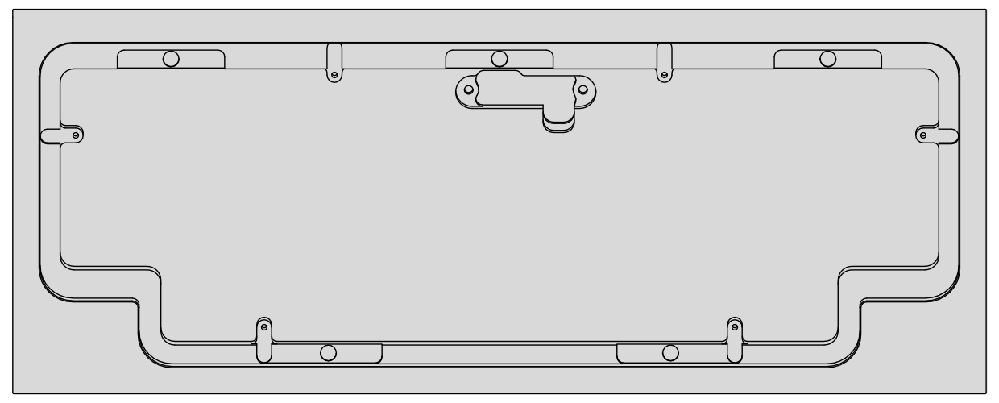                               | アルミまたはポリカーボネートのケース。                                |
| デコレーションカバー        | 1           |       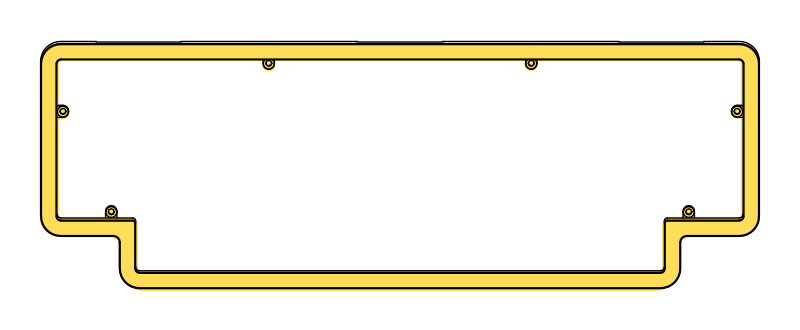                              | アルミまたは真鍮のパーツ。                                            |
| PCB                         | 1           |    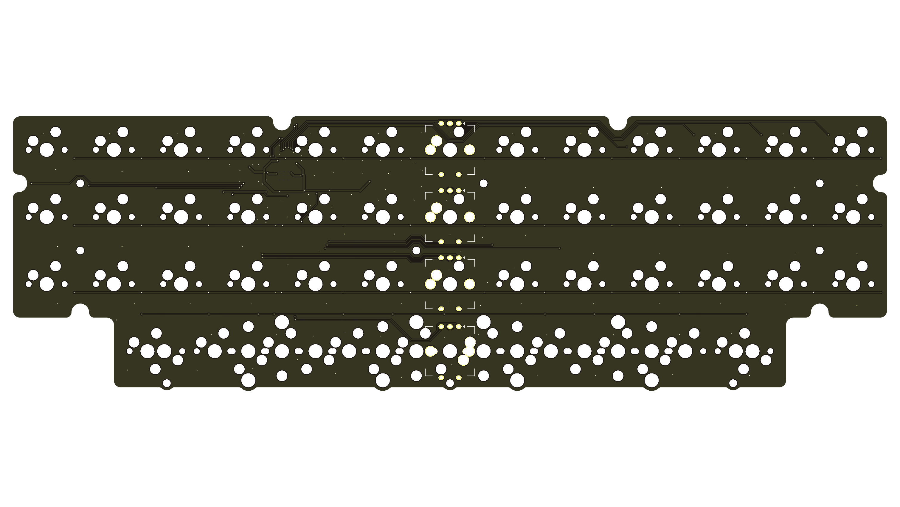                                 | キーボードの本体となる基板。パーツはすべて実装済みです。厚みは1.6mm。 |
| ドーターボード              | 1           |       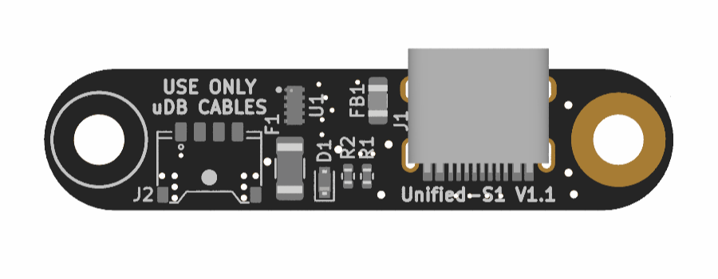                              | USBコネクター部分の基板。                                             |
| ドーターボードケーブル      | 1           |     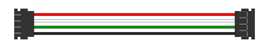                                | PCBとドータボードを接続するためのケーブル。                           |
| スイッチプレート            | 1           |   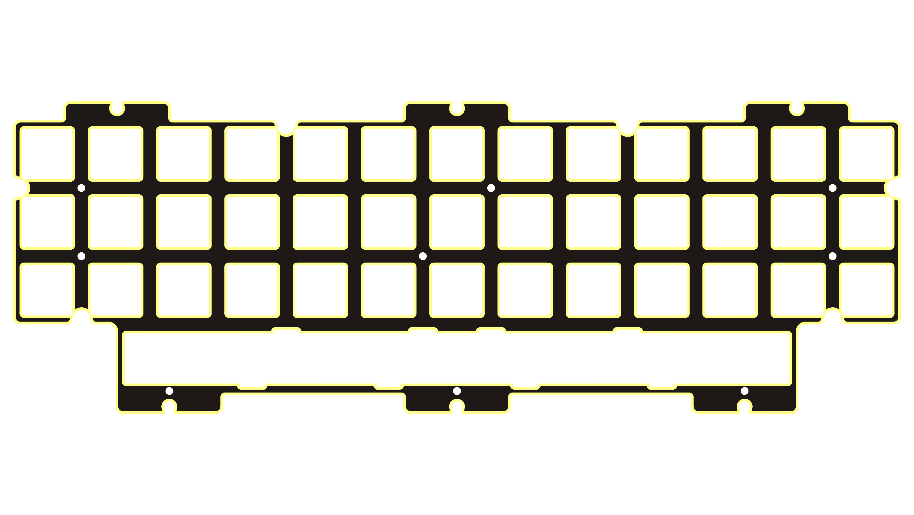                                  | キースイッチを固定するためのプレート。                                |
| ミドルフォーム              | 1           |                                     | スイッチプレートとPCBの間に挟む4mm厚のSlimFlex(旧PORON)フォーム。     |
| ダンピングボール            | 8(内予備2)  |                                     | マウント用のシリコン製ダンピングボール。                              |
| SlimFlex(旧PORON)ガスケット | 14(内予備2) |                                     | マウント用の2mm厚SlimFlex(旧PORON)フォーム。                          |
| M2x3.5 スペーサー           | 11(内予備2) |                                     | スイッチプレートとPCBを固定するための4mm径のスペーサ。                |
| M2x6 皿ねじ                 | 8(内予備2)  |                                     | デコレーションカバーをメインケースに固定するためのねじ。              |
| M2x3 低頭ねじ               | 20(内予備2) |  | スイッチプレートにPCBを取り付けるためのねじ。                         |
| M3x4 なべねじ               | 3(内予備1)  |                                     | ドーターボードをメインケースに取り付けるためのねじ。                  |
| ゴム足                      | 8(内予備2)  |                                     | メインケースに貼り付ける滑り止め。                                    |
| +ドライバー                 | 1           |                                     | ねじを締め付けるために使用します。                                    |

### 1.1.2. ご自身でご用意いただくパーツ・工具
キット以外に以下のパーツが必要になります。
ご自身でお気に入りのものをご用意ください。

| 名称                                  | 数量     | 説明                                                                                                                                           |
|---------------------------------------|----------|------------------------------------------------------------------------------------------------------------------------------------------------|
| MX(互換)キースイッチ                  | 38から49 | 選択したレイアウトに応じて必要な個数をご用意ください。                                                                                         |
| PCBマウント MX(互換)スタビライザー 3U | 0から2   | 選択したレイアウトに応じてお好みでご用意ください。PCB厚1.6mm対応のものをご利用ください。                                                       |
| PCBマウント MX(互換)スタビライザー 6U | 0から1   | 選択したレイアウトに応じてお好みでご用意ください。PCB厚1.6mm対応のものをご利用ください。                                                       |
| PCBマウント MX(互換)スタビライザー 7U | 0から1   | 選択したレイアウトに応じてお好みでご用意ください。PCB厚1.6mm対応のものをご利用ください。                                                       |
| EC12(互換)ロータリーエンコーダー      | 0から4   | 選択したレイアウトに応じて必要な個数をご用意ください。ロータリーエンコーダーを取り付ける場合ははんだ付けが必要になります。                     |
| MX(互換)キーキャップ                  | 1セット  | お好きなものをご用意ください。ただし、キースイッチの南向き、北向きが混在するため、使用するキーキャップによってはキースイッチと干渉する可能性があります。 |
| USB Type-Cケーブル                    | 1        | お好きなものをご用意ください。ただし、コネクター部分の形状によっては奥まで挿し込めない可能性があります。                                       |
| はんだごて                            | 一式     | ロータリーエンコーダーを取り付けたい場合はご用意ください。一般的な電子工作用のはんだごてで十分です。                                           |
| はんだ                                | 適量     | ロータリーエンコーダーを取り付けたい場合はご用意ください。                                                                                     |

## 1.2. PCBの動作確認
### 1.2.1. Vial環境の準備
キーマップの変更にはVial( https://get.vial.today )を使用します。
以下のいずれかの環境をご用意ください。
- Web版（最新のChrome、Chromium、Edge推奨）
- デスクトップアプリ版

### 1.2.2. 接続確認
1. PCBとドーターボードをドーターボードケーブルで接続する
2. USB Type-CケーブルでPCとドーターボードを接続する
3. Web版、またはデスクトップアプリ版Vialを起動し、キーボードが認識されていることを確認する
   - 認識しない場合は[5. トラブルシューティング](#5-トラブルシューティング)をご確認ください。
4. 確認できたらPCから取り外し、PCB、ドーターボード、ドーターボードケーブルに分解する

# 2. 組み立て
## 2.1. レイアウトの選択
組み立て後にスタビライザー、またはロータリーエンコーダーを取り付けることはできないため、この時点で[対応レイアウト](https://www.keyboard-layout-editor.com/#/gists/7c5d01b070eb4d64d19c3d557c21d5dd)から使いたいレイアウトを選択します。  
スタビライザー、またはロータリーエンコーダーを取り付けない場合は組み立て後からもレイアウトを変更できるため、この項目はスキップしてください。

### 2.1.1. スタビライザーの取り付け
使いたいレイアウトに応じて以下の位置にスタビライザーを取り付けます。  
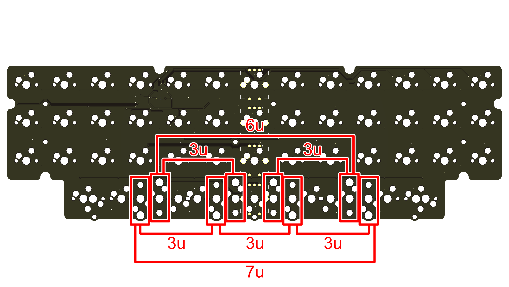

### 2.1.2. ロータリーエンコーダーの取り付け
使いたいレイアウトに応じて以下の位置にロータリーエンコーダーをはんだ付けします。  
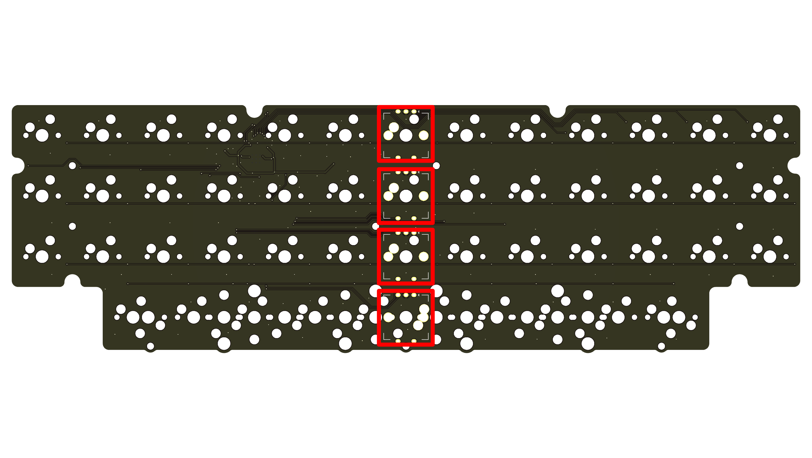

## 2.3. PCB組み立て
1. PCBに`M2x3 低頭ねじ`でスペーサーを取り付ける  
   [!WARNING]
   レイアウトによってはスタビライザーと下段中央のスペーサーが干渉します。その場合は下段中央のスペーサーは取り付けないでください。
   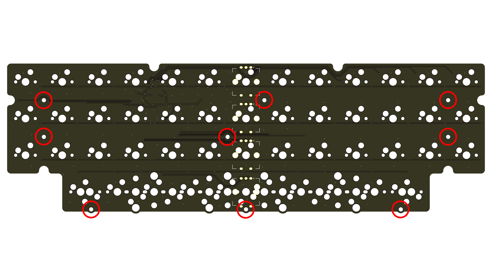   
2. スペーサーと穴の位置を合わせてPCBにフォームを置く  
3. フォームの上にスイッチプレートを乗せ、`M2x3 低頭ねじ`で固定する
   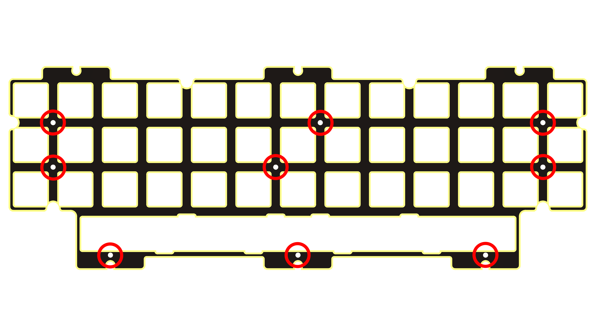
   - スペーサーの高さよりもフォームのほうが少し厚くなっています。  
     指でPCBをスイッチプレート側に押しながらねじを締めてください。
## 2.4. ドーターボード取り付け
1. ドーターボードにドーターボードケーブルを取り付ける
2. ケースに`M3x4 なべねじ`でドーターボードを取り付ける
   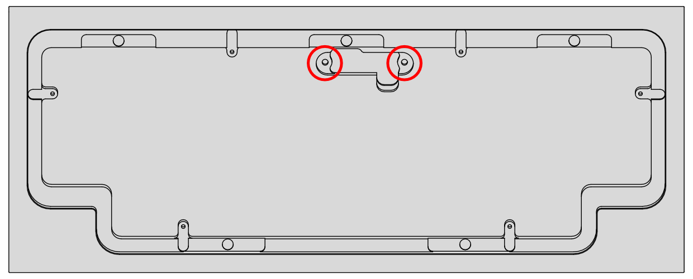
## 2.5. 組み立て
1. スイッチプレートにダンピングボール、またはSlimFlexガスケットのいずれかを取り付ける
   - ダンピングボールの場合  
     スイッチプレートの窪みに合わせてダンピングボールを取り付けます。  
     
   - SlimFlexガスケットの場合  
     スイッチプレートのタブの両面にSlimFlexガスケットを貼り付けます。  
     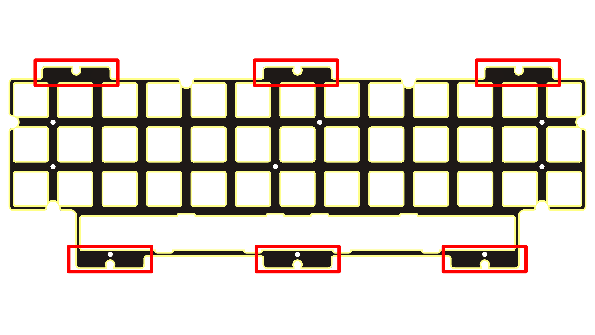
2. PCBとドーターボードをドーターボードケーブルで接続する
3. スイッチプレートのタブをケースの窪みに合わせて置き、デコレーションカバーを`M2x6 皿ねじ`で固定する  
   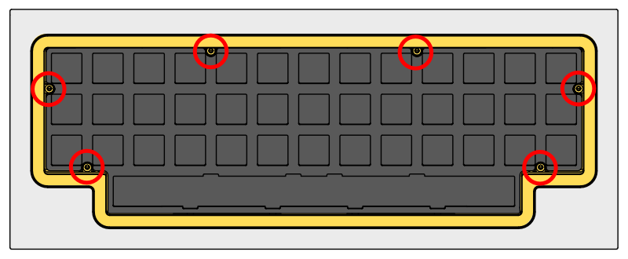
4. ケース底面にゴム足を貼り付ける  
   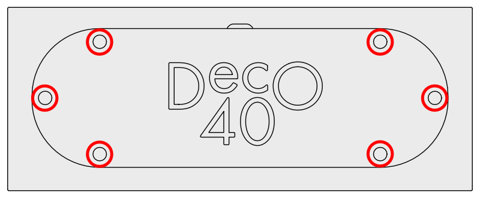
## 2.5. 動作確認
1. 選択したレイアウトに応じてキースイッチを取り付ける
2. USB Type-CケーブルでPCとDeco40キーボードを接続する
3. Web版、またはデスクトップアプリ版Vialを起動する
4. `Layout`タブを表示し、レイアウトを選択する  
   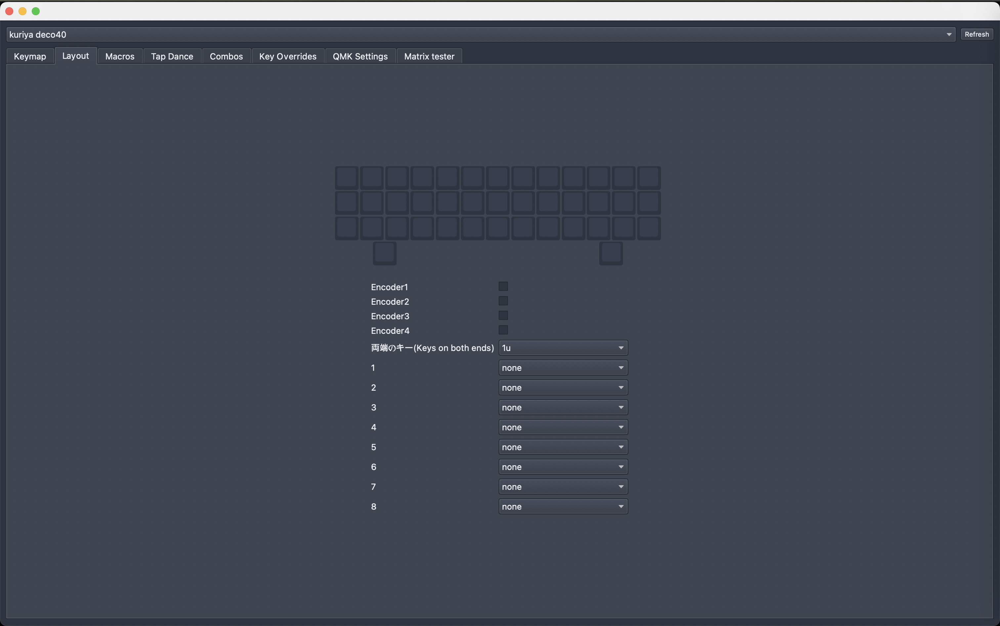
   1. 両端のキーサイズを選択します
   2. レイアウトの1のキーサイズを選択します  
      [!WARNING]
      両端のキーサイズとして1.5uを選択した場合は`shifted`記載のあるものを選択してください。
   3. 選択したキーサイズに記載されている`Go to section XX`に従い、その番号のキーサイズを選択する
   4. 全てのキーサイズを選択するまで、手順2、3を繰り返す
5. `Matrix tester`タブを表示し、 `Unlock`ボタンをクリックする  
   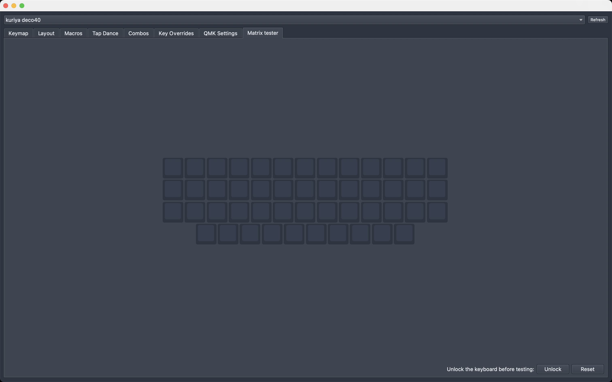
6. 表示された二箇所のキーを長押しする  
   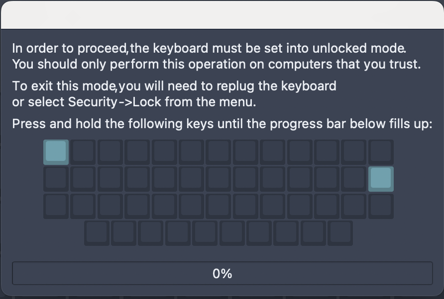
   - キーを押しているのに進捗バーが進まない場合、キーが反応していない可能性があります。  
     [5. トラブルシューティング](#5-トラブルシューティング)をご確認ください。
7. 全キーが反応することを確認する  
   - 反応しないキーがある場合は[5. トラブルシューティング](#5-トラブルシューティング)をご確認ください。
## 2.7. キーキャップ取り付け
用意したお気に入りのキーキャップを取り付けてください。  
もう少しで完成です。

# 3. キーマップの設定
`Keymap`タブを表示し、お好みのキーマップを設定してください。  
画面上部から変更したいキーをクリックし、その後、設定したいキーを画面下部から選択します。  
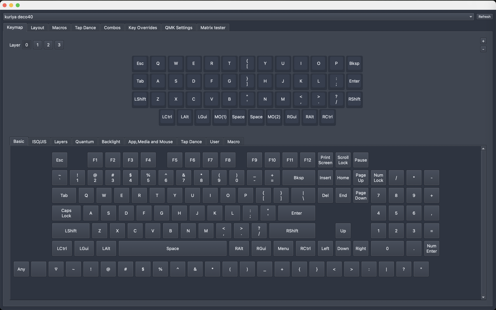

# 4. メンテナンス
## 4.1. ファームウェア更新
1. デコレーションカバーを外す
2. PCBを裏返す
3. USB Type-CケーブルでPCとDeco40キーボードを接続する
4. PCBの`BOOT`スイッチを押しながら`RESET`スイッチを押す
   - PCにUSBストレージとして認識されます。
5. 認識したUSBストレージに新しいファームウェアをコピーする
   - コピーが完了すると自動でUSBストレージが取り出され、キーボードとして認識されます。
6. 組み立てる

# 5. トラブルシューティング
## 5.1. キーボードがPCに認識されない
以下手順を順番に試してください。
1. ドーターボードとPCBの接続を確認する
   - ドーターボード・PCB両方のソケットの奥までコネクターが挿さっていることを確認してください。
2. USB Type-Cケーブルが奥まで挿さっているか確認する
   - コネクター部分の形状によってはケースと干渉する可能性があります。  
     別のUSB Type-Cケーブルでの接続もお試しください。
3. [6. 連絡先](#6-連絡先)に連絡する
   - お手数をおかけしますが、連絡先のいずれかから私に連絡をしてください。  
     その際詳しい症状・写真も添付していただけますとありがたいです。
## 5.2. 反応しないキーがある
以下手順を順番に試してください。
1. 反応しないキーのスイッチを外す
2. キースイッチの足が曲がっていないことを確認する
   - 足が曲がっていた場合は新しいキースイッチに交換するか、足を真っ直ぐに修正してから再度取り付けてください。
3. キースイッチが正しく挿さっていることを確認する
   - キースイッチがスイッチプレートから浮いている場合は、浮かないように奥まで挿してください。
4. [6. 連絡先](#6-連絡先)に連絡する
   - お手数をおかけしますが、連絡先のいずれかから私に連絡をしてください。  
     その際詳しい症状・写真も添付していただけますとありがたいです。
## 5.3. ロータリーエンコーダーが反応しない
以下手順を順番に試してください。
1. 正しくはんだ付けできていることを確認する
   - キーソケットとの共存のため、はんだ付け部分(パッド)が小さくなっています。  
     再度はんだごてでパッドを熱し、はんだ付けできていることを確認してください。
2. [6. 連絡先](#6-連絡先)に連絡する
   - お手数をおかけしますが、連絡先のいずれかから私に連絡をしてください。  
     その際詳しい症状・写真も添付していただけますとありがたいです。

# 6. 連絡先
- X(Twitter): https://x.com/kuriki_sasa
- Bluesky: https://bsky.app/profile/kurikisasa.bsky.social
- Discord: kurikisasa
- Discord server: https://discord.gg/pC4t9NJStE

# さいごに
無事、完成できましたでしょうか？  
感想・写真などありましたらお気軽に教えていただけると喜びます！  
良きキーボードライフを！
